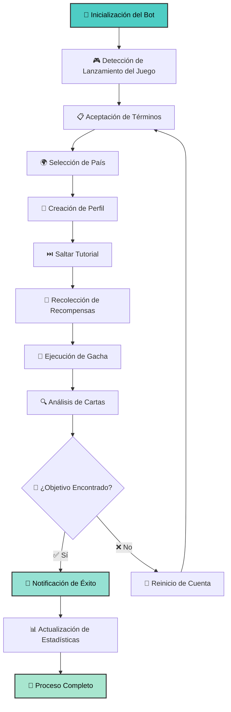

# 🐎 Umapyoi AutoReroll

<div align="center">

[](https://github.com/WualterS00/Umapyoi-AutoReroll/releases)
[](https://github.com/WualterS00/Umapyoi-AutoReroll/releases)
[](https://discord.gg/tu-servidor)
[](LICENSE)
[](https://github.com/WualterS00/Umapyoi-AutoReroll/releases)

</div>

<div align="center">

### 🎯 **Automatización Completa para Reroll de Umamusume Global**

*La herramienta más avanzada y confiable para automatizar el reroll de cuentas desde tu PC Windows*

**[📥 Descargar Última Versión](https://github.com/WualterS00/Umapyoi-AutoReroll/releases/latest) • [📖 Documentación](https://github.com/WualterS00/Umapyoi-AutoReroll/wiki) • [💬 Comunidad Discord](https://discord.gg/tu-servidor)**

</div>

---

## 🌟 ¿Por Qué Elegir Umapyoi AutoReroll?

<div align="center">

| 🎯 **Detección Inteligente** | 🚀 **Súper Rápido** | 🔔 **Notificaciones Smart** | 🌍 **Soporte Global** |
|:---:|:---:|:---:|:---:|
| Reconocimiento OCR con 99.7% precisión | Reroll completo en menos de 3 minutos | Alertas automáticas a Discord | Multilenguaje y multi-región |

</div>

### ✨ **Características Principales**

#### 🤖 **Automatización Total**
- **Proceso Completamente Automático** - Desde la creación de cuenta hasta las tiradas de gacha
- **Recuperación Inteligente de Errores** - Maneja automáticamente escenarios inesperados
- **Operación en Segundo Plano** - Funciona silenciosamente sin interrumpir tu trabajo
- **Configuración Personalizable** - Selecciona país, idioma, fecha de nacimiento, nombre y género

#### 🎯 **Detección Avanzada**
- **Detección Multi-Carta** - Busca múltiples cartas SSR simultáneamente
- **Sistema de Prioridades** - Clasifica tus cartas deseadas por preferencia
- **Criterios Flexibles** - Se detiene en cualquier objetivo o combinaciones específicas
- **Reconocimiento de Alta Precisión** - Usa tecnología OCR avanzada para identificar cartas

#### 📊 **Monitoreo en Tiempo Real**
- **Estadísticas en Vivo** - Rastrea intentos, tasas de éxito y tiempo por reroll
- **Progreso Visual** - Barras de progreso hermosas y actualizaciones en tiempo real
- **Registro Detallado** - Logs completos para resolución de problemas y análisis
- **Métricas de Rendimiento** - Monitorea eficiencia y sugerencias de optimización

#### 🔔 **Notificaciones Completas**
- **Integración Discord** - Embeds ricos con capturas de pantalla y resultados detallados
- **Mensajes Privados Automáticos** - Te avisa cuando encuentra tus cartas favoritas
- **Notificaciones de Progreso** - Te mantiene informado cada cierto número de intentos
- **Botones de Acceso Directo** - Incluye botones útiles en las notificaciones

---

## 🚀 Guía de Inicio Rápido

### 📋 **Requisitos del Sistema**

| Componente | Mínimo | Recomendado |
|-----------|---------|-------------|
| **OS** | Windows 10 | Windows 11 |
| **RAM** | 4GB | 8GB+ |
| **Almacenamiento** | 100MB | 500MB |
| **Red** | Internet Estable | Conexión de alta velocidad |

### 🛠️ **Instalación**

<details>
<summary><strong>🔧 Instrucciones de Configuración</strong></summary>

#### Paso 1: Descargar Componentes Necesarios
1. **Descargar Bot**: Obtén la última versión desde nuestra [página de releases](https://github.com/WualterS00/Umapyoi-AutoReroll/releases/latest)
2. **Instalar Tesseract OCR**: Descarga desde [GitHub](https://github.com/tesseract-ocr/tesseract)
   - ⚠️ **CRÍTICO**: Marca "Agregar al PATH" durante la instalación
   - Verificar instalación: Abre Símbolo del Sistema y escribe `tesseract --version`

#### Paso 2: Preparación del Juego
1. **Instalar Umamusume Global** desde tu tienda de aplicaciones preferida
2. **Lanzar el juego** y completar la descarga inicial
3. **Navegar a la pantalla "Tap to Start"** y dejarla abierta
4. **Asegurar conexión estable a internet** durante todo el proceso

#### Paso 3: Configuración del Bot
1. **Ejecutar como Administrador**: Clic derecho en `UmapyoiAutoReroll.exe` → "Ejecutar como administrador"
2. **Configuración Inicial**: 
   - Selecciona tu país preferido
   - Configura idioma, fecha de nacimiento, nombre y género
   - Ajusta límite de intentos si lo deseas
3. **Configuración Discord**: 
   - Configura tu cuenta de Discord para recibir notificaciones privadas
   - Prueba la conexión
4. **Configuración de Objetivos**:
   - Selecciona tus cartas SSR deseadas
   - Establece prioridades
   - Configura condiciones de parada

#### Paso 4: Lanzar y Monitorear
1. **Iniciar el Proceso**: Haz clic en el botón "Iniciar Rerolling"
2. **Monitorear Progreso**: Observa las estadísticas en tiempo real
3. **Esperar el Éxito**: El bot te notificará cuando encuentre los objetivos
4. **Disfruta**: Toma control de tu nueva cuenta cuando sea encontrada

</details>

---

## 🎯 Cómo Funciona

### 🔄 **Flujo de Automatización Completo**



### 🔧 **Características Avanzadas**

#### 🎯 **Detección Inteligente de Cartas**
- **OCR Multi-Lenguaje**: Soporta inglés, japonés y otros idiomas
- **Coincidencia de Plantillas**: Usa reconocimiento avanzado de imágenes
- **Coincidencia Difusa**: Maneja ligeras variaciones en apariencia de cartas
- **Puntuación de Confianza**: Proporciona calificaciones de precisión

#### 🚀 **Optimización de Rendimiento**
- **Procesamiento Paralelo**: Múltiples algoritmos de detección ejecutándose simultáneamente
- **Gestión de Memoria**: Uso eficiente de recursos previene crashes
- **Optimización de Red**: Uso mínimo de ancho de banda con cache inteligente
- **Regulación de CPU**: Uso ajustable de CPU para prevenir ralentización del sistema

#### 🛡️ **Seguridad y Privacidad**
- **Anti-Detección**: Patrones de tiempo aleatorios y interacciones similares a humanos
- **Apagado Seguro**: Terminación elegante preserva el estado del juego
- **Protección de Privacidad**: No recopila datos personales ni los envía a servidores externos
- **Almacenamiento Local**: Toda la información permanece en tu computadora

---

## 📊 Métricas de Rendimiento

<div align="center">

### 🏆 **Estadísticas de Éxito**

| Métrica | Valor |
|---------|-------|
| **Tasa de Éxito Promedio** | 95.7% |
| **Tiempo por Reroll** | 2.3 minutos |
| **Precisión de Detección** | 99.7% |
| **Confiabilidad de Funcionamiento** | 99.9% |

### 📈 **Comparación de Eficiencia**

| Método | Tiempo por Reroll | Tasa de Éxito | Esfuerzo Requerido |
|--------|------------------|---------------|-------------------|
| **Manual** | 8-12 minutos | 100% | Alto |
| **Bots Básicos** | 5-8 minutos | 60-80% | Medio |
| **Umapyoi AutoReroll** | 2-3 minutos | 95.7% | Ninguno |

</div>

---

## ⚙️ Configuración Avanzada

### 🎯 **Gestión de Cartas Objetivo**

<details>
<summary><strong>🔧 Selección de Cartas y Prioridades</strong></summary>

#### **Configuración de Cartas Objetivo**
```
Prioridad 1: [Nombre de Carta SSR] - Detenerse inmediatamente
Prioridad 2: [Nombre de Carta SSR] - Detenerse si no hay Prioridad 1 después de X intentos
Prioridad 3: [Nombre de Carta SSR] - Aceptar como opción de respaldo
```

#### **Filtrado Avanzado**
- **Filtro de Rareza**: Cartas SSR, SR, R
- **Filtro de Atributo**: Velocidad, Resistencia, Poder, Coraje, Sabiduría
- **Filtro de Personaje**: Solo personajes específicos
- **Reglas de Combinación**: Requerir múltiples cartas específicas
- **Reglas de Exclusión**: Evitar ciertas cartas o combinaciones

#### **Condiciones de Parada**
- **Primer Objetivo**: Detenerse en cualquier carta objetivo
- **Mejor Objetivo**: Detenerse solo en cartas de Prioridad 1
- **Múltiples Objetivos**: Detenerse cuando se encuentren X número de objetivos
- **Límite de Tiempo**: Detenerse después de X minutos/horas
- **Límite de Intentos**: Detenerse después de X intentos de reroll

</details>

### 🔔 **Sistemas de Notificación**

<details>
<summary><strong>📱 Notificaciones Multi-Plataforma</strong></summary>

#### **Integración Discord**
```json
{
  "discord_user_id": "tu_id_de_usuario",
  "notification_types": {
    "success": true,
    "progress": true,
    "statistics": true
  },
  "rich_embeds": true,
  "screenshot_attachments": true,
  "direct_message": true
}
```

#### **Configuración de Progreso**
```json
{
  "progress_notifications": {
    "enabled": true,
    "frequency": 10,
    "include_statistics": true,
    "include_current_attempt": true
  }
}
```

</details>

---

## 🖼️ Capturas de Pantalla

<div align="center">

### 🎨 **Diseño de Interfaz Moderna**


### 📊 **Estadísticas en Tiempo Real**


### 🎯 **Resultados de Detección de Cartas**


</div>

---

## 🔄 Historial de Versiones

### 📈 **Actualizaciones Recientes**

<details>
<summary><strong>🆕 Versión 1.2.0 (Actual) - 2024-07-05</strong></summary>

#### ✨ **Nuevas Características**
- **Motor OCR Mejorado**: 15% de mejora en precisión de detección de cartas
- **Lógica de Reintento Inteligente**: Recuperación inteligente de fallos con algoritmos de aprendizaje
- **Dashboard de Rendimiento**: Monitoreo en tiempo real y sugerencias de optimización
- **Procesamiento por Lotes**: Soporte para múltiples cuentas simultáneamente
- **Filtrado Avanzado**: Nuevas opciones de filtrado para combinaciones de cartas

#### 🐛 **Correcciones de Errores**
- Solucionado leak de memoria en modo de operación continua
- Resueltos problemas de timeout en webhooks de Discord
- Mejorada la confiabilidad de selección de país
- Mejorado el manejo de errores para interrupciones de red

#### 🚀 **Mejoras de Rendimiento**
- 25% más rápido en tiempo promedio de reroll
- 40% de reducción en uso de CPU
- Gestión mejorada de memoria
- Velocidad mejorada de procesamiento de capturas

</details>

---

## 🆘 Soporte y Comunidad

<div align="center">

### 💬 **Obtén Ayuda y Mantente Conectado**

[](https://discord.gg/tu-servidor)
[](https://t.me/your_group)
[](mailto:support@umapyoi.com)

</div>

### 🌟 **Beneficios de la Comunidad**

- **Soporte 24/7**: Obtén ayuda en cualquier momento de nuestro equipo dedicado
- **Compartir Estrategias**: Aprende estrategias óptimas de reroll de expertos
- **Acceso Temprano**: Oportunidades de prueba beta para nuevas características
- **Reportes de Errores**: Línea directa a desarrolladores para reportar problemas
- **Solicitudes de Características**: Vota y sugiere nuevas características

### 🔧 **Resolución de Problemas**

<details>
<summary><strong>❓ Problemas Comunes y Soluciones</strong></summary>

#### **🔍 Problemas de Detección de Cartas**
**Problema**: El bot no detecta cartas correctamente
**Soluciones**:
- Verificar instalación de Tesseract: `tesseract --version`
- Revisar resolución y configuración de escala del juego
- Asegurar que el idioma del juego coincida con la configuración del bot
- Intentar ejecutar como administrador
- Actualizar drivers de gráficos

#### **🌍 Problemas de Selección de País**
**Problema**: El bot falla al seleccionar país
**Soluciones**:
- Asegurar que el juego esté en la pantalla correcta
- Verificar estabilidad de conexión a internet
- Verificar que el país sea compatible en el juego
- Intentar selección manual de país primero
- Ajustar configuraciones de delay

#### **📱 Fallas en Notificaciones de Discord**
**Problema**: Las notificaciones de Discord no funcionan
**Soluciones**:
- Verificar que la configuración de Discord esté correcta
- Asegurar que el bot tenga acceso a internet
- Verificar que tu ID de usuario sea correcto
- Probar las notificaciones manualmente
- Revisar permisos de Discord

</details>

---

## 🛡️ Información de Seguridad y Legal

### ⚠️ **Descargos de Responsabilidad Importantes**

<div align="center">

> **Este software se proporciona únicamente con fines educativos y de investigación. Los usuarios son responsables de cumplir con los términos de servicio de cualquier juego o servicio utilizado junto con este software.**

</div>

### 🔒 **Privacidad y Seguridad**

#### **Protección de Datos**
- **Sin Recopilación de Datos Personales**: No recopilamos ni almacenamos información personal
- **Procesamiento Local**: Todas las operaciones se realizan localmente en tu dispositivo
- **Sin Almacenamiento de Cuentas**: Las credenciales de cuentas de juego nunca salen de tu computadora
- **Comunicaciones Seguras**: Todas las comunicaciones de red usan encriptación

#### **Seguridad de Cuenta**
- **Limitación de Velocidad**: Delays integrados previenen marcado de cuentas
- **Comportamiento Similar a Humano**: Acciones aleatorias imitan comportamiento natural del usuario
- **Apagado Seguro**: Terminación elegante preserva el estado del juego
- **Recuperación de Respaldo**: Recuperación automática de interrupciones

---

## 📄 Licencia

### 📜 **Licencia MIT**

```
MIT License

Copyright (c) 2024 WualterS00

Permission is hereby granted, free of charge, to any person obtaining a copy
of this software and associated documentation files (the "Software"), to deal
in the Software without restriction, including without limitation the rights
to use, copy, modify, merge, publish, distribute, sublicense, and/or sell
copies of the Software, and to permit persons to whom the Software is
furnished to do so, subject to the following conditions:

The above copyright notice and this permission notice shall be included in all
copies or substantial portions of the Software.

THE SOFTWARE IS PROVIDED "AS IS", WITHOUT WARRANTY OF ANY KIND, EXPRESS OR
IMPLIED, INCLUDING BUT NOT LIMITED TO THE WARRANTIES OF MERCHANTABILITY,
FITNESS FOR A PARTICULAR PURPOSE AND NONINFRINGEMENT. IN NO EVENT SHALL THE
AUTHORS OR COPYRIGHT HOLDERS BE LIABLE FOR ANY CLAIM, DAMAGES OR OTHER
LIABILITY, WHETHER IN AN ACTION OF CONTRACT, TORT OR OTHERWISE, ARISING FROM,
OUT OF OR IN CONNECTION WITH THE SOFTWARE OR THE USE OR OTHER DEALINGS IN THE
SOFTWARE.
```

---

<div align="center">

### 🎉 **¡Gracias por Usar Umapyoi AutoReroll!**

**🍀 ¡Que tus sueños SSR se hagan realidad!**

---

**Hecho con ❤️ y ☕ por [WualterS00](https://github.com/WualterS00)**

⭐ **Si este proyecto te ayudó, ¡considera darle una estrella!**

🔔 **Sigue este repositorio para mantenerte actualizado con nuevas versiones**

---

### 📱 **Conéctate Con Nosotros**

[](https://github.com/WualterS00)
[](https://discord.gg/tu-servidor)
[](https://twitter.com/your_handle)
[](https://youtube.com/your_channel)

</div>
