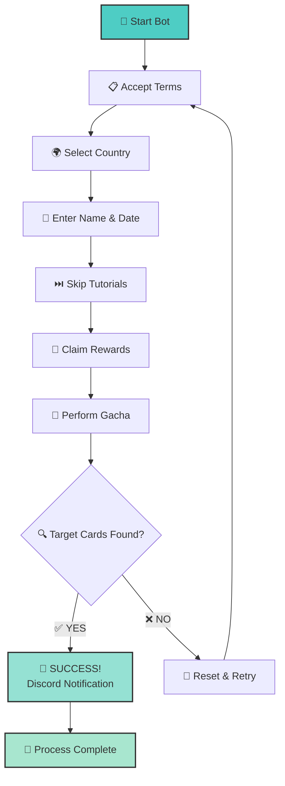
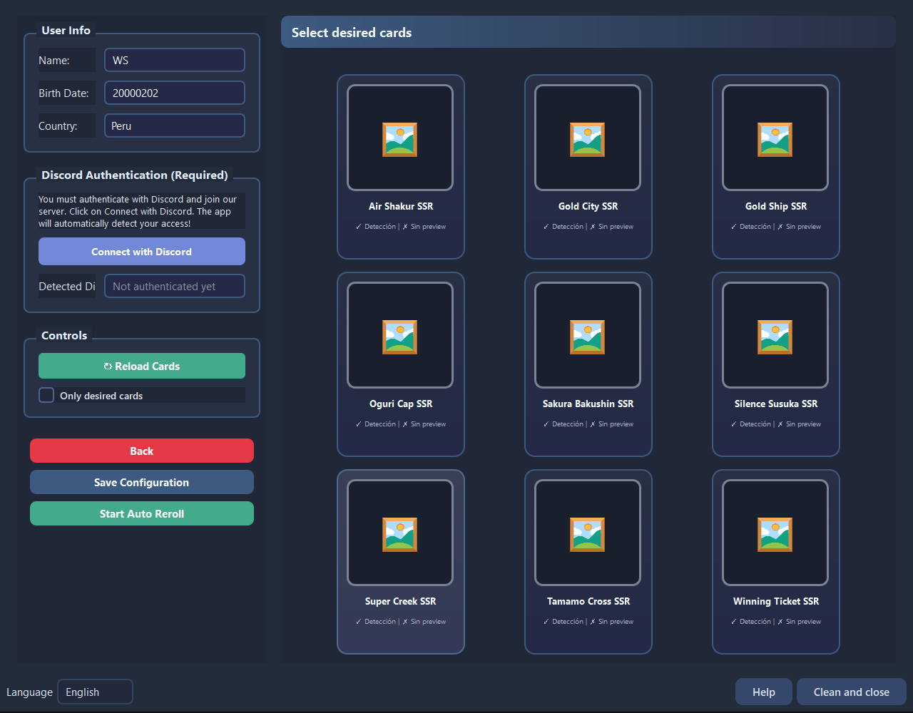

# 🐎 Umapyoi AutoReroll

<div align="center">
  
[](https://github.com/WualterSEA/Umapyoi-AutoReroll/releases)
[](https://github.com/WualterSEA/Umapyoi-AutoReroll/releases)
[](https://discord.gg/tu-servidor)
[](LICENSE)

**🎯 Automation bot for Umamusume Global rerolling**  
**🎯 Bot de automatización para reroll de Umamusume Global**

*Easy • Fast • Reliable • Discord Notifications*

**[📥 Download Latest Release](https://github.com/WualterSEA/Umapyoi-AutoReroll/releases/latest)**

---

</div>

## 🌟 Key Features

<div align="center">

| 🤖 **Fully Automated** | 📱 **Discord Integration** | 🌍 **Multi-Language** | ⚡ **Lightweight** |
|:---:|:---:|:---:|:---:|
| Complete process automation | Real-time notifications | English & Spanish | No installation needed |
| From start to finish | Success/failure alerts | Native support | Just download & run |

</div>

---

## 🚀 Quick Start

### 📋 **What You Need**
- ✅ **Umamusume Global** (installed and ready)
- ✅ **Tesseract OCR** → [Download here](https://github.com/tesseract-ocr/tesseract)
- ✅ **Discord Account** (for notifications)

### 🔧 **Installation Steps**

1. **📥 Download**
   ```
   Go to → Releases → Download UmapyoiAutoReroll.exe
   ```

2. **🛠️ Install Tesseract OCR**
   - Download from link above
   - ⚠️ **IMPORTANT**: Check "Add to PATH" during installation

3. **🎮 Setup Game**
   - Open Umamusume Global
   - Leave it on the "Tap to Start" screen

4. **🚀 Run Bot**
   - Execute `UmapyoiAutoReroll.exe`
   - Choose your language
   - Configure Discord webhook
   - Set your target cards
   - Click **Start**!

---

## 🎯 How It Works

<details>
<summary><strong>📋 Complete Process Breakdown</strong></summary>



**🔄 Step-by-Step Process:**

1. **🤝 Accept Terms** - Automatically accepts game terms and conditions
2. **🌍 Country Selection** - Chooses your country (searches if not visible)
3. **👤 Profile Setup** - Enters name and birthdate automatically
4. **⏭️ Skip Content** - Bypasses unnecessary tutorials and cutscenes
5. **🎁 Claim Rewards** - Collects all available starter rewards
6. **🎲 Gacha Pull** - Performs the initial gacha summon
7. **🔍 Card Detection** - Scans results for your desired SSR cards
8. **🔄 Auto Retry** - Resets and repeats if targets not found

</details>

---

## 🖼️ Screenshots

<div align="center">

### 🇬🇧 English Interface



### 🇪🇸 Interfaz en Español


</div>

---

## ⚙️ Configuration Guide

<details>
<summary><strong>🔧 Discord Webhook Setup</strong></summary>

### Step 1: Create Webhook
1. Go to your Discord server
2. Right-click on the channel where you want notifications
3. Select **Edit Channel** → **Integrations** → **Webhooks**
4. Click **New Webhook**
5. Copy the webhook URL

### Step 2: Configure Bot
1. Paste the webhook URL in the bot settings
2. Choose notification types:
   - ✅ Success notifications
   - ❌ Failure alerts
   - 📊 Progress updates
   - 🎯 Final results

</details>

<details>
<summary><strong>🎯 Reroll Settings</strong></summary>

### Target Cards
- Select which SSR cards you want to obtain
- Support for multiple target cards
- Priority ranking system available

### Limits & Timing
- **Max Attempts**: Set reroll limit (0 = unlimited)
- **Delay Settings**: Adjust timing between actions
- **Timeout Settings**: Configure wait times
- **Country Selection**: Choose your region

### Advanced Options
- **Screenshot Mode**: Save screenshots of results
- **Verbose Logging**: Detailed process logs
- **Auto-Stop**: Stop on first success or after X attempts

</details>

---

## 🔄 Version History

<details>
<summary><strong>📋 Changelog</strong></summary>

### 🆕 **v1.1.0** (2024-07-05)
**✨ New Features:**
- ➕ Added support for new card types
- 🎯 Enhanced card detection accuracy
- ⚡ Performance optimization improvements
- 🔍 Better OCR text recognition

**🐛 Bug Fixes:**
- 🔧 Fixed card selection issues on certain devices
- 🌍 Resolved country selection problems
- 📱 Improved Discord notification reliability

### 🎉 **v1.0.0** (2024-06-25)
**Initial Release:**
- 🤖 Core reroll automation
- 📱 Discord notifications
- 🌍 Multi-language support (EN/ES)
- 🎯 Target card detection

</details>

---

## 🆘 Support & Help

<div align="center">

### 💬 **Get Help**

[](https://discord.gg/tu-servidor)
[](mailto:soporte@tu-dominio.com)

**🔥 Join our Discord for:**
- 🆘 Real-time support
- 📢 Bot updates & announcements
- 💬 Community discussions
- 🛠️ Troubleshooting help
- 🎯 Tips & strategies

</div>

### 🤔 **Common Issues**

<details>
<summary><strong>❓ Bot not detecting cards</strong></summary>

**Possible Solutions:**
- ✅ Ensure Tesseract is properly installed and in PATH
- ✅ Check if game resolution is supported
- ✅ Verify Discord webhook is working
- ✅ Try adjusting delay settings
- ✅ Run as administrator

</details>

<details>
<summary><strong>❓ Country selection fails</strong></summary>

**Possible Solutions:**
- ✅ Ensure game is on the correct screen
- ✅ Check if your country is supported
- ✅ Try manual country selection first
- ✅ Verify game language settings

</details>

---

## ⚠️ Important Notes

> **🛡️ Disclaimer**: This tool is for educational purposes only. Use at your own risk. We are not responsible for any account issues that may arise from using automation tools.

> **📱 Game Compatibility**: Currently supports Umamusume Global version. Other versions may not work properly.

> **🔄 Rate Limits**: Be mindful of game rate limits. Excessive rerolling may trigger anti-automation measures.

---

## 📄 License

This project is licensed under the **MIT License** - see the [LICENSE](LICENSE) file for details.

---

<div align="center">

**🍀 Good luck with your SSR pulls!**  
**🍀 ¡Mucha suerte con tus SSR!**

---

**Made with ❤️ by [WualterSEA](https://github.com/WualterSEA)**

⭐ **If this helped you, please star the repository!**

**🔔 Watch this repo to get notified of updates**

---

### 📊 **Project Stats**


</div>

---

<!-- SEO Keywords -->
<!--
UMA BOT, UMA BOT GLOBAL, UMAMUSUME BOT, UMAMUSUME REROLL AUTOMATICO, AUTO REROLL UMA, UMAMUSUME REROLL BOT, UMAPYOI BOT, UMA RERROL AUTO, AUTO REROLL UMAMUSUME, REROLL BOT UMA, GACHA BOT UMA, UMA AUTO REROLL, UMAMUSUME AUTO BOT, REROLL AUTOMÁTICO UMA, AUTO UMA, UMA GLOBAL, UMA GLOBAL BOT, UMAMUSUME GLOBAL BOT, UMAPYOI REROLL, UMAPYOI REROLL BOT, UMAPYOI AUTOREROLL, UMAMUSUME AUTOREROLL, UMA AUTOREROLL, AUTOREROLL UMA, UMAMUSUME AUTO REROLL
-->
