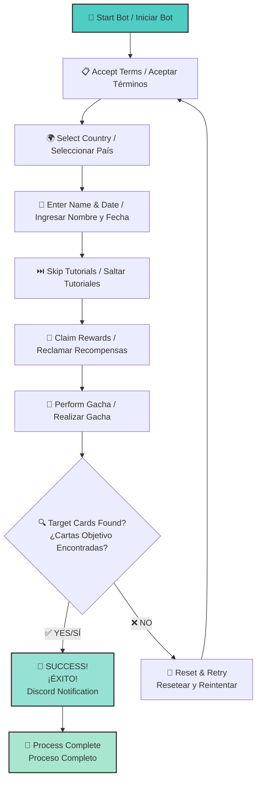

# 🐎 Umapyoi AutoReroll

<div align="center">
  
[](https://github.com/WualterS00/Umapyoi-AutoReroll/releases)
[](https://github.com/WualterS00/Umapyoi-AutoReroll/releases)
[](https://discord.gg/tu-servidor)
[](LICENSE)

**🎯 Automation bot for Umamusume Global rerolling**  
**🎯 Bot de automatización para reroll de Umamusume Global**

*Easy • Fast • Reliable • Discord Notifications*  
*Fácil • Rápido • Confiable • Notificaciones Discord*

**[📥 Download Latest Release / Descargar Última Versión](https://github.com/WualterS00/Umapyoi-AutoReroll/releases/latest)**

---

</div>

## 🌟 Key Features / Características Principales

<div align="center">

| 🤖 **Fully Automated**<br/>**Completamente Automatizado** | 📱 **Discord Integration**<br/>**Integración Discord** | 🌍 **Multi-Language**<br/>**Multilenguaje** | ⚡ **Lightweight**<br/>**Ligero** |
|:---:|:---:|:---:|:---:|
| Complete process automation<br/>Automatización completa del proceso | Real-time notifications<br/>Notificaciones en tiempo real | English & Spanish<br/>Inglés y Español | No installation needed<br/>No requiere instalación |
| From start to finish<br/>De principio a fin | Success/failure alerts<br/>Alertas de éxito/fallo | Native support<br/>Soporte nativo | Just download & run<br/>Solo descarga y ejecuta |

</div>

---

## 🚀 Quick Start / Guía Rápida

### 📋 **What You Need / Lo que Necesitas**
- ✅ **Umamusume Global** (installed and ready / instalado y listo)
- ✅ **Tesseract OCR** → [Download here / Descargar aquí](https://github.com/tesseract-ocr/tesseract)
- ✅ **Discord Account** (for notifications / para notificaciones)

### 🔧 **Installation Steps / Pasos de Instalación**

<details>
<summary><strong>🇬🇧 English Instructions</strong></summary>

1. **📥 Download**
   ```
   Go to → Releases → Download UmapyoiAutoReroll.exe
   ```

2. **🛠️ Install Tesseract OCR**
   - Download from link above
   - ⚠️ **IMPORTANT**: Check "Add to PATH" during installation

3. **🎮 Setup Game**
   - Open Umamusume Global
   - Leave it on the "Tap to Start" screen

4. **🚀 Run Bot**
   - Execute `UmapyoiAutoReroll.exe`
   - Choose your language
   - Configure Discord webhook
   - Set your target cards
   - Click **Start**!

</details>

<details>
<summary><strong>🇪🇸 Instrucciones en Español</strong></summary>

1. **📥 Descargar**
   ```
   Ve a → Releases → Descarga UmapyoiAutoReroll.exe
   ```

2. **🛠️ Instalar Tesseract OCR**
   - Descarga desde el enlace de arriba
   - ⚠️ **IMPORTANTE**: Marca "Agregar al PATH" durante la instalación

3. **🎮 Configurar Juego**
   - Abre Umamusume Global
   - Déjalo en la pantalla "Tap to Start"

4. **🚀 Ejecutar Bot**
   - Ejecuta `UmapyoiAutoReroll.exe`
   - Elige tu idioma
   - Configura el webhook de Discord
   - Establece tus cartas objetivo
   - ¡Haz clic en **Iniciar**!

</details>

---

## 🎯 How It Works / Cómo Funciona

<details>
<summary><strong>📋 Complete Process Breakdown / Desglose Completo del Proceso</strong></summary>



**🇬🇧 English - Step-by-Step Process:**

1. **🤝 Accept Terms** - Automatically accepts game terms and conditions
2. **🌍 Country Selection** - Chooses your country (searches if not visible)
3. **👤 Profile Setup** - Enters name and birthdate automatically
4. **⏭️ Skip Content** - Bypasses unnecessary tutorials and cutscenes
5. **🎁 Claim Rewards** - Collects all available starter rewards
6. **🎲 Gacha Pull** - Performs the initial gacha summon
7. **🔍 Card Detection** - Scans results for your desired SSR cards
8. **🔄 Auto Retry** - Resets and repeats if targets not found

**🇪🇸 Español - Proceso Paso a Paso:**

1. **🤝 Aceptar Términos** - Acepta automáticamente los términos del juego
2. **🌍 Selección de País** - Elige tu país (busca si no está visible)
3. **👤 Configurar Perfil** - Ingresa nombre y fecha de nacimiento automáticamente
4. **⏭️ Saltar Contenido** - Omite tutoriales y escenas innecesarias
5. **🎁 Reclamar Recompensas** - Recolecta todas las recompensas iniciales disponibles
6. **🎲 Pull del Gacha** - Realiza la invocación inicial del gacha
7. **🔍 Detección de Cartas** - Escanea los resultados por tus cartas SSR deseadas
8. **🔄 Reintentar Automático** - Resetea y repite si no encuentra los objetivos

</details>

---

## 🖼️ Screenshots / Capturas de Pantalla

<div align="center">

### 🇬🇧 English Interface / Interfaz en Inglés


### 🇪🇸 Spanish Interface / Interfaz en Español


</div>

---

## ⚙️ Configuration Guide / Guía de Configuración

<details>
<summary><strong>🔧 Discord Webhook Setup / Configuración del Webhook de Discord</strong></summary>

### 🇬🇧 English Instructions:

**Step 1: Create Webhook**
1. Go to your Discord server
2. Right-click on the channel where you want notifications
3. Select **Edit Channel** → **Integrations** → **Webhooks**
4. Click **New Webhook**
5. Copy the webhook URL

**Step 2: Configure Bot**
1. Paste the webhook URL in the bot settings
2. Choose notification types:
   - ✅ Success notifications
   - ❌ Failure alerts
   - 📊 Progress updates
   - 🎯 Final results

### 🇪🇸 Instrucciones en Español:

**Paso 1: Crear Webhook**
1. Ve a tu servidor de Discord
2. Haz clic derecho en el canal donde quieres las notificaciones
3. Selecciona **Editar Canal** → **Integraciones** → **Webhooks**
4. Haz clic en **Nuevo Webhook**
5. Copia la URL del webhook

**Paso 2: Configurar Bot**
1. Pega la URL del webhook en la configuración del bot
2. Elige los tipos de notificación:
   - ✅ Notificaciones de éxito
   - ❌ Alertas de fallo
   - 📊 Actualizaciones de progreso
   - 🎯 Resultados finales

</details>

<details>
<summary><strong>🎯 Reroll Settings / Configuración del Reroll</strong></summary>

### 🇬🇧 English Settings:

**Target Cards**
- Select which SSR cards you want to obtain
- Support for multiple target cards
- Priority ranking system available

**Limits & Timing**
- **Max Attempts**: Set reroll limit (0 = unlimited)
- **Delay Settings**: Adjust timing between actions
- **Timeout Settings**: Configure wait times
- **Country Selection**: Choose your region

**Advanced Options**
- **Screenshot Mode**: Save screenshots of results
- **Verbose Logging**: Detailed process logs
- **Auto-Stop**: Stop on first success or after X attempts

### 🇪🇸 Configuración en Español:

**Cartas Objetivo**
- Selecciona qué cartas SSR quieres obtener
- Soporte para múltiples cartas objetivo
- Sistema de ranking de prioridad disponible

**Límites y Timing**
- **Intentos Máximos**: Establece límite de reroll (0 = ilimitado)
- **Configuración de Delay**: Ajusta el tiempo entre acciones
- **Configuración de Timeout**: Configura tiempos de espera
- **Selección de País**: Elige tu región

**Opciones Avanzadas**
- **Modo Screenshot**: Guarda capturas de los resultados
- **Logging Detallado**: Registros detallados del proceso
- **Auto-Stop**: Detener en el primer éxito o después de X intentos

</details>

---

## 🔄 Version History / Historial de Versiones

<details>
<summary><strong>📋 Changelog / Registro de Cambios</strong></summary>

### 🆕 **v1.1.0** (2024-07-05)

**🇬🇧 English:**
**✨ New Features:**
- ➕ Added support for new card types
- 🎯 Enhanced card detection accuracy
- ⚡ Performance optimization improvements
- 🔍 Better OCR text recognition

**🐛 Bug Fixes:**
- 🔧 Fixed card selection issues on certain devices
- 🌍 Resolved country selection problems
- 📱 Improved Discord notification reliability

**🇪🇸 Español:**
**✨ Nuevas Características:**
- ➕ Añadido soporte para nuevos tipos de cartas
- 🎯 Mejorada la precisión de detección de cartas
- ⚡ Mejoras en la optimización de rendimiento
- 🔍 Mejor reconocimiento de texto OCR

**🐛 Correcciones:**
- 🔧 Arreglado problemas de selección de cartas en ciertos dispositivos
- 🌍 Resueltos problemas de selección de país
- 📱 Mejorada la confiabilidad de notificaciones Discord

### 🎉 **v1.0.0** (2024-06-25)

**🇬🇧 English - Initial Release:**
- 🤖 Core reroll automation
- 📱 Discord notifications
- 🌍 Multi-language support (EN/ES)
- 🎯 Target card detection

**🇪🇸 Español - Lanzamiento Inicial:**
- 🤖 Automatización básica de reroll
- 📱 Notificaciones Discord
- 🌍 Soporte multilenguaje (EN/ES)
- 🎯 Detección de cartas objetivo

</details>

---

## 🆘 Support & Help / Soporte y Ayuda

<div align="center">

### 💬 **Get Help / Obtener Ayuda**

[](https://discord.gg/tu-servidor)
[](mailto:soporte@tu-dominio.com)

**🇬🇧 Join our Discord for:**
- 🆘 Real-time support
- 📢 Bot updates & announcements
- 💬 Community discussions
- 🛠️ Troubleshooting help
- 🎯 Tips & strategies

**🇪🇸 Únete a nuestro Discord para:**
- 🆘 Soporte en tiempo real
- 📢 Actualizaciones del bot y anuncios
- 💬 Discusiones de la comunidad
- 🛠️ Ayuda con problemas
- 🎯 Consejos y estrategias

</div>

### 🤔 **Common Issues / Problemas Comunes**

<details>
<summary><strong>❓ Bot not detecting cards / Bot no detecta cartas</strong></summary>

**🇬🇧 English - Possible Solutions:**
- ✅ Ensure Tesseract is properly installed and in PATH
- ✅ Check if game resolution is supported
- ✅ Verify Discord webhook is working
- ✅ Try adjusting delay settings
- ✅ Run as administrator

**🇪🇸 Español - Posibles Soluciones:**
- ✅ Asegúrate de que Tesseract esté instalado correctamente y en PATH
- ✅ Verifica si la resolución del juego está soportada
- ✅ Confirma que el webhook de Discord funcione
- ✅ Intenta ajustar la configuración de delay
- ✅ Ejecuta como administrador

</details>

<details>
<summary><strong>❓ Country selection fails / Selección de país falla</strong></summary>

**🇬🇧 English - Possible Solutions:**
- ✅ Ensure game is on the correct screen
- ✅ Check if your country is supported
- ✅ Try manual country selection first
- ✅ Verify game language settings

**🇪🇸 Español - Posibles Soluciones:**
- ✅ Asegúrate de que el juego esté en la pantalla correcta
- ✅ Verifica si tu país está soportado
- ✅ Intenta la selección manual de país primero
- ✅ Confirma la configuración de idioma del juego

</details>

---

## ⚠️ Important Notes / Notas Importantes

<details>
<summary><strong>🛡️ Disclaimer / Descargo de Responsabilidad</strong></summary>

**🇬🇧 English:**
> This tool is for educational purposes only. Use at your own risk. We are not responsible for any account issues that may arise from using automation tools.

**🇪🇸 Español:**
> Esta herramienta es solo para fines educativos. Úsala bajo tu propio riesgo. No somos responsables de ningún problema de cuenta que pueda surgir del uso de herramientas de automatización.

</details>

<details>
<summary><strong>📱 Game Compatibility / Compatibilidad del Juego</strong></summary>

**🇬🇧 English:**
> Currently supports Umamusume Global version. Other versions may not work properly.

**🇪🇸 Español:**
> Actualmente soporta la versión Global de Umamusume. Otras versiones pueden no funcionar correctamente.

</details>

<details>
<summary><strong>🔄 Rate Limits / Límites de Velocidad</strong></summary>

**🇬🇧 English:**
> Be mindful of game rate limits. Excessive rerolling may trigger anti-automation measures.

**🇪🇸 Español:**
> Ten en cuenta los límites de velocidad del juego. El reroll excesivo puede activar medidas anti-automatización.

</details>

---

## 📄 License / Licencia

**🇬🇧 English:**  
This project is licensed under the **MIT License** - see the [LICENSE](LICENSE) file for details.

**🇪🇸 Español:**  
Este proyecto está licenciado bajo la **Licencia MIT** - ver el archivo [LICENSE](LICENSE) para más detalles.

---

<div align="center">

**🇬🇧 🍀 Good luck with your SSR pulls!**  
**🇪🇸 🍀 ¡Mucha suerte con tus SSR!**

---

**Made with ❤️ by [WualterS00](https://github.com/WualterS00)**

⭐ **🇬🇧 If this helped you, please star the repository!**  
⭐ **🇪🇸 ¡Si esto te ayudó, por favor dale una estrella al repositorio!**

🔔 **🇬🇧 Watch this repo to get notified of updates**  
🔔 **🇪🇸 Sigue este repositorio para recibir notificaciones de actualizaciones**

---

### 📊 **Project Stats / Estadísticas del Proyecto**


</div>

---

<!-- SEO Keywords -->
<!--
UMA BOT, UMA BOT GLOBAL, UMAMUSUME BOT, UMAMUSUME REROLL AUTOMATICO, AUTO REROLL UMA, UMAMUSUME REROLL BOT, UMAPYOI BOT, UMA RERROL AUTO, AUTO REROLL UMAMUSUME, REROLL BOT UMA, GACHA BOT UMA, UMA AUTO REROLL, UMAMUSUME AUTO BOT, REROLL AUTOMÁTICO UMA, AUTO UMA, UMA GLOBAL, UMA GLOBAL BOT, UMAMUSUME GLOBAL BOT, UMAPYOI REROLL, UMAPYOI REROLL BOT, UMAPYOI AUTOREROLL, UMAMUSUME AUTOREROLL, UMA AUTOREROLL, AUTOREROLL UMA, UMAMUSUME AUTO REROLL
-->
