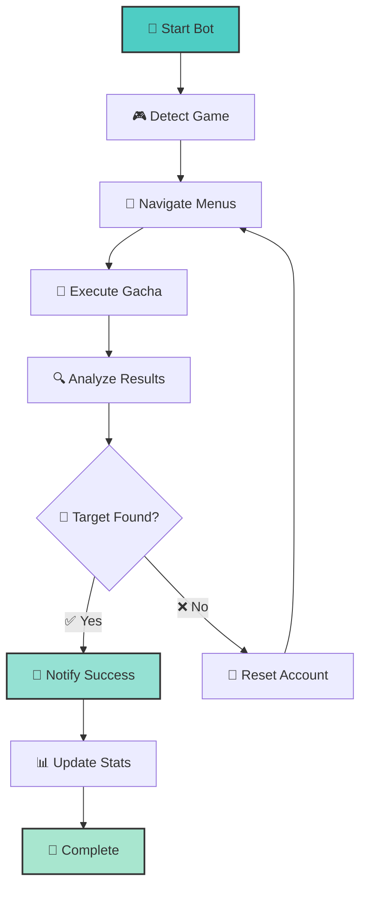

# 🐎 Umapyoi AutoReroll

<div align="center">

[](https://github.com/WualterS00/Umapyoi-AutoReroll)
[](https://github.com/WualterS00/Umapyoi-AutoReroll/releases)
[](https://github.com/WualterS00/Umapyoi-AutoReroll)
[](LICENSE)

</div>

<div align="center">

### 🎯 **Umamusume Global Reroll Automation**
*A modern automation tool for efficient rerolling in Umamusume Pretty Derby*

**⚠️ EARLY DEVELOPMENT - ACTIVE WORK IN PROGRESS**

</div>

---

## 🌟 Project Vision

Creating the most **reliable** and **user-friendly** reroll automation tool for Umamusume Global. Built with modern technologies and designed for both beginners and advanced users.

<div align="center">

| 🎯 **Smart Automation** | 🔍 **OCR Detection** | 🔔 **Notifications** | 🌍 **Multi-Platform** |
|:---:|:---:|:---:|:---:|
| Automated reroll process | Card recognition system | Discord & webhook alerts | Cross-platform support |
| *In Development* | *In Development* | *Planned* | *Planned* |

</div>

---

## 🚀 Current Development Status

### ✅ **Completed Features**
- [x] Basic project structure
- [x] Core automation framework
- [x] Initial UI design
- [x] Basic error handling

### 🔄 **In Active Development**
- [ ] **OCR Card Detection** - Image recognition for SSR cards
- [ ] **Game Integration** - Seamless interaction with Umamusume Global
- [ ] **Automated Reroll Logic** - Complete automation workflow
- [ ] **User Interface** - Modern, intuitive control panel

### 📋 **Planned Features**
- [ ] **Discord Notifications** - Real-time alerts with rich embeds
- [ ] **Advanced Filtering** - Target specific cards and combinations
- [ ] **Statistics Dashboard** - Track progress and success rates
- [ ] **Multi-language Support** - English, Spanish, Japanese
- [ ] **Webhook Integration** - Custom notification endpoints
- [ ] **Performance Optimization** - Speed and efficiency improvements

---

## 🛠️ Technical Architecture

### 🔧 **Core Technologies**
```
🐍 Python 3.11+     │ Core application framework
🖼️ OpenCV           │ Image processing and detection
🤖 Tesseract OCR    │ Optical character recognition
🎨 Tkinter/PyQt     │ Modern user interface
📊 SQLite           │ Local data storage
🔗 Requests         │ HTTP client for notifications
```

### 🏗️ **System Requirements**
| Component | Minimum | Recommended |
|-----------|---------|-------------|
| **OS** | Windows 10 | Windows 11 |
| **Python** | 3.9+ | 3.11+ |
| **RAM** | 4GB | 8GB |
| **Storage** | 50MB | 200MB |

---

## 📦 Installation & Setup

### 🚧 **For Developers (Current)**

```bash
# Clone the repository
git clone https://github.com/WualterS00/Umapyoi-AutoReroll.git
cd Umapyoi-AutoReroll

# Create virtual environment
python -m venv venv
source venv/bin/activate  # On Windows: venv\Scripts\activate

# Install dependencies
pip install -r requirements.txt

# Run development version
python main.py
```

### 📥 **For End Users**
**Coming Soon** - Pre-built executables will be available once the first stable version is ready.

---

## 🎯 How It Will Work

### 🔄 **Planned Automation Flow**



### 🎨 **Planned Interface Design**

<div align="center">

*Modern, clean interface with real-time progress tracking*

📊 **Dashboard** • 🎯 **Target Selection** • 🔔 **Notifications** • 📈 **Statistics**

</div>

---

## 🔧 Development Roadmap

### 🎯 **Phase 1: Foundation** *(Current - Week 1)*
- [x] Project setup and architecture
- [x] Core framework implementation
- [ ] Basic OCR integration
- [ ] Simple UI prototype

### 🚀 **Phase 2: Core Features** *(Weeks 2-4)*
- [ ] Complete automation logic
- [ ] Advanced OCR card detection
- [ ] User interface polish
- [ ] Error handling and recovery

### 🌟 **Phase 3: Enhancement** *(Weeks 5-8)*
- [ ] Discord notification system
- [ ] Advanced filtering options
- [ ] Performance optimizations
- [ ] Comprehensive testing

### 🎉 **Phase 4: Release** *(Week 9+)*
- [ ] Beta testing program
- [ ] Documentation completion
- [ ] First stable release
- [ ] Community building

---

## 🤝 Contributing

### 🌟 **We Welcome Contributors!**

This project is actively seeking contributors in all areas:

#### 👨‍💻 **Developers**
- Python backend development
- UI/UX implementation
- OCR and image processing
- Testing and QA

#### 🎨 **Designers**
- UI/UX design
- Icon and asset creation
- Documentation design
- Branding and visual identity

#### 🧪 **Testers**
- Feature testing
- Bug reporting
- Performance testing
- User experience feedback

### 📝 **How to Contribute**

1. **Fork** the repository
2. **Create** a feature branch (`git checkout -b feature/amazing-feature`)
3. **Commit** your changes (`git commit -m 'Add amazing feature'`)
4. **Push** to the branch (`git push origin feature/amazing-feature`)
5. **Open** a Pull Request

---

## 📊 Development Progress

<div align="center">

### 🔥 **Current Week Focus**
**Core Automation & OCR Integration**

| Task | Progress | Status |
|------|----------|--------|
| **Game Detection** | ████████░░ 80% | 🔄 In Progress |
| **OCR Setup** | ██████░░░░ 60% | 🔄 In Progress |
| **UI Framework** | ███░░░░░░░ 30% | 🔄 In Progress |
| **Menu Navigation** | ██░░░░░░░░ 20% | 📋 Planned |

</div>

---

## 📞 Connect & Support

<div align="center">

### 🤝 **Join the Development**

[](https://github.com/WualterS00)
[](#)
[](https://github.com/WualterS00/Umapyoi-AutoReroll/issues)
[](https://github.com/WualterS00/Umapyoi-AutoReroll/discussions)

</div>

### 💬 **Development Updates**

Stay updated with our progress:
- 📅 **Weekly dev logs** on GitHub
- 🐛 **Bug reports** and issue tracking
- 💡 **Feature suggestions** and discussions
- 📸 **Progress screenshots** and demos

---

## ⚠️ Important Notes

### 🔒 **Disclaimer**
This project is in **early development** and is provided for educational purposes. Always comply with the terms of service of any games or platforms you use.

### 🛡️ **Safety First**
- All processing is done locally on your device
- No personal data is collected or transmitted
- Designed with anti-detection measures in mind
- Graceful error handling to protect your accounts

### 📜 **License**
This project is licensed under the MIT License - see the [LICENSE](LICENSE) file for details.

---

<div align="center">

## 🌟 **Star This Project!**

If you're interested in this project or want to support its development, please consider giving it a star! ⭐

**🔔 Watch this repository to stay updated with development progress**

---

### 🎉 **Thank You for Your Interest!**

**Made with ❤️ and lots of ☕ by [WualterS00](https://github.com/WualterS00)**

*This project is just getting started - exciting things are coming! 🚀*

---

**📈 Development Status: Week 1 of Development**  
**🎯 Next Milestone: Basic OCR Integration**  
**📅 Last Updated: July 2025**

</div>
