# 🐎 Umapyoi AutoReroll

<div align="center">

[](https://github.com/WualterS00/Umapyoi-AutoReroll/releases)
[](https://github.com/WualterS00/Umapyoi-AutoReroll/releases)
[](https://discord.gg/tu-servidor)
[](LICENSE)
[](https://github.com/WualterS00/Umapyoi-AutoReroll/releases)

</div>

<div align="center">

### 🎯 **Premium Automation for Umamusume Global Rerolling**
### 🎯 **Automatización Premium para Reroll de Umamusume Global**

*The most advanced, reliable, and user-friendly reroll bot available*  
*El bot de reroll más avanzado, confiable y fácil de usar disponible*

**[📥 Download Latest Version](https://github.com/WualterS00/Umapyoi-AutoReroll/releases/latest) • [📖 Documentation](https://github.com/WualterS00/Umapyoi-AutoReroll/wiki) • [💬 Discord Community](https://discord.gg/tu-servidor)**

</div>

---

## 🌟 Why Choose Umapyoi AutoReroll?

<div align="center">

| 🎯 **Intelligent Detection** | 🚀 **Complete Automation** | 🔔 **Discord Notifications** | 🌍 **Windows Support** |
|:---:|:---:|:---:|:---:|
| Advanced OCR card recognition | Full process automation | Instant success alerts | Windows 10/11 compatible |
| Reconocimiento OCR avanzado | Automatización completa | Alertas instantáneas | Compatible con Windows 10/11 |

</div>

### ✨ **Key Features**

#### 🤖 **Complete Process Automation**
- **Total Control**: Automatically handles account creation, tutorials, and gacha pulls
- **Background Operation**: Runs silently while you use your computer for other tasks
- **Unlimited Attempts**: Repeats the entire process until your target cards are obtained
- **Smart Configuration**: Choose your country, language, birthday, character name and gender easily

#### 🎯 **Advanced Card Detection**
- **Multi-Card Selection**: Target multiple SSR cards simultaneously
- **High Precision Recognition**: Advanced image recognition technology for accurate card detection
- **Automatic Rewards Collection**: Collects all initial game rewards automatically
- **Tutorial Skip**: Automatically skips tutorials, dialogues, warnings, and welcome screens

#### 🔔 **Discord Integration**
- **Instant Notifications**: Receive private Discord messages when target cards are found
- **Rich Embeds**: Beautiful messages with card images and names
- **Progress Updates**: Optional notifications every X attempts to track progress
- **Quick Access Buttons**: Direct action buttons from notifications

#### 🛡️ **Safe & Secure**
- **No Data Storage**: Doesn't store your personal information
- **No External Servers**: Only sends notifications you configure
- **Privacy Protected**: Designed with user safety in mind
- **Local Processing**: All operations performed on your device

---

## 🚀 Quick Start Guide

### 📋 **Requirements**

| Component | Needed |
|-----------|---------|
| **OS** | Windows 10/11 |
| **Additional Software** | Tesseract OCR |
| **Game** | Umamusume Global |
| **Notifications** | Discord Account |

### 🛠️ **Installation**

<details>
<summary><strong>🇬🇧 English Setup Instructions</strong></summary>

#### Step 1: Download Required Components
1. **Download Bot**: Get the latest version from our [releases page](https://github.com/WualterS00/Umapyoi-AutoReroll/releases/latest)
2. **Install Tesseract OCR**: Download from [GitHub](https://github.com/tesseract-ocr/tesseract)
   - ⚠️ **CRITICAL**: Check "Add to PATH" during installation
   - Verify installation: Open Command Prompt and type `tesseract --version`

#### Step 2: Game Preparation
1. **Install Umamusume Global** from your preferred app store
2. **Launch the game** and complete initial download
3. **Navigate to "Tap to Start"** screen and leave it open
4. **Ensure stable internet connection** throughout the process

#### Step 3: Bot Configuration
1. **Run as Administrator**: Right-click `UmapyoiAutoReroll.exe` → "Run as administrator"
2. **Language Selection**: Choose your preferred language
3. **Discord Setup**: 
   - Create a Discord webhook in your server
   - Paste the webhook URL in bot settings
   - Test the connection
4. **Target Configuration**:
   - Select your desired SSR cards
   - Configure character settings (name, gender, country, birthday)
   - Set notification preferences

#### Step 4: Launch & Monitor
1. **Start the Process**: Click the "Start Rerolling" button
2. **Monitor Progress**: Watch real-time status updates
3. **Wait for Success**: The bot will notify you when targets are found
4. **Take Control**: Manual intervention when prompted for completion

</details>

<details>
<summary><strong>🇪🇸 Instrucciones de Configuración en Español</strong></summary>

#### Paso 1: Descargar Componentes Necesarios
1. **Descargar Bot**: Obtén la última versión desde nuestra [página de releases](https://github.com/WualterS00/Umapyoi-AutoReroll/releases/latest)
2. **Instalar Tesseract OCR**: Descarga desde [GitHub](https://github.com/tesseract-ocr/tesseract)
   - ⚠️ **CRÍTICO**: Marca "Agregar al PATH" durante la instalación
   - Verificar instalación: Abre Símbolo del Sistema y escribe `tesseract --version`

#### Paso 2: Preparación del Juego
1. **Instalar Umamusume Global** desde tu tienda de aplicaciones preferida
2. **Lanzar el juego** y completar la descarga inicial
3. **Navegar a la pantalla "Tap to Start"** y dejarla abierta
4. **Asegurar conexión estable a internet** durante todo el proceso

#### Paso 3: Configuración del Bot
1. **Ejecutar como Administrador**: Clic derecho en `UmapyoiAutoReroll.exe` → "Ejecutar como administrador"
2. **Selección de Idioma**: Elige tu idioma preferido
3. **Configuración Discord**: 
   - Crea un webhook de Discord en tu servidor
   - Pega la URL del webhook en la configuración del bot
   - Prueba la conexión
4. **Configuración de Objetivos**:
   - Selecciona tus cartas SSR deseadas
   - Configura ajustes del personaje (nombre, género, país, fecha de nacimiento)
   - Establece preferencias de notificación

#### Paso 4: Lanzar y Monitorear
1. **Iniciar el Proceso**: Haz clic en el botón "Iniciar Rerolling"
2. **Monitorear Progreso**: Observa las actualizaciones de estado en tiempo real
3. **Esperar el Éxito**: El bot te notificará cuando encuentre los objetivos
4. **Tomar Control**: Intervención manual cuando se solicite para completar

</details>

---

## 🎯 How It Works

### 🔄 **Complete Automation Flow**

```mermaid
graph TD
    A[🚀 Bot Initialization] --> B[🎮 Game Launch Detection]
    B --> C[📋 Terms Acceptance]
    C --> D[🌍 Country Selection]
    D --> E[👤 Profile Creation]
    E --> F[⏭️ Tutorial Skip]
    F --> G[🎁 Rewards Collection]
    G --> H[🎲 Gacha Execution]
    H --> I[🔍 Card Analysis]
    I --> J{🎯 Target Found?}
    J -->|✅ Yes| K[🎉 Success Notification]
    J -->|❌ No| L[🔄 Account Reset]
    L --> C
    K --> M[🏁 Process Complete]
    
    style A fill:#4ECDC4,stroke:#333,stroke-width:2px,color:#000
    style K fill:#95E1D3,stroke:#333,stroke-width:2px,color:#000
    style M fill:#A8E6CF,stroke:#333,stroke-width:2px,color:#000
```



### 🔧 **What Makes It Special**

#### 🎯 **Intelligent Operation**
- **Automatic Tutorial Skip**: Bypasses all tutorials, dialogues, warnings, and welcome screens
- **Smart Timing**: Optimized delays prevent detection and ensure smooth operation
- **Error Recovery**: Handles unexpected scenarios and continues automatically
- **Flexible Configuration**: Customizable settings for different preferences

#### 🚀 **Effortless Experience**
- **No Manual Clicking**: Complete hands-off operation once configured
- **Background Processing**: Use your computer normally while bot works
- **Unlimited Persistence**: Continues until success or configured attempt limit
- **Real-time Feedback**: Always know what the bot is doing

---

## 🖼️ Screenshots & Interface

<div align="center">

### 🎨 **Modern Interface Design**


### 🎯 **Card Detection Results**


</div>

---

## 🆘 Support & Community

<div align="center">

### 💬 **Get Help & Stay Connected**

[](https://discord.gg/tu-servidor)
[](https://t.me/your_group)
[](mailto:support@umapyoi.com)

</div>

### 🔧 **Troubleshooting**

<details>
<summary><strong>❓ Common Issues & Solutions</strong></summary>

#### **🔍 Card Detection Issues**
**Problem**: Bot not detecting cards correctly
**Solutions**:
- Verify Tesseract installation: `tesseract --version`
- Check game resolution and scale settings
- Ensure game language matches bot settings
- Try running as administrator
- Update graphics drivers

#### **🌍 Country Selection Problems**
**Problem**: Bot fails to select country
**Solutions**:
- Ensure game is on correct screen
- Check internet connection stability
- Verify country is supported in game
- Try manual country selection first

#### **📱 Discord Notification Failures**
**Problem**: Discord notifications not working
**Solutions**:
- Verify webhook URL is correct
- Test webhook using online tools
- Check Discord server permissions
- Ensure bot has internet access
- Verify webhook channel exists

#### **🚀 Performance Issues**
**Problem**: Bot running slowly or freezing
**Solutions**:
- Close unnecessary programs
- Restart computer and try again
- Check for Windows updates
- Ensure sufficient disk space

</details>

---

## 🛡️ Safety & Legal Information

### ⚠️ **Important Disclaimers**

<div align="center">

> **🇬🇧 This software is provided for educational and research purposes only. Users are responsible for complying with the terms of service of any games or services used in conjunction with this software.**

> **🇪🇸 Este software se proporciona únicamente con fines educativos y de investigación. Los usuarios son responsables de cumplir con los términos de servicio de cualquier juego o servicio utilizado junto con este software.**

</div>

### 🔒 **Privacy & Security**

#### **Data Protection**
- **No Personal Data Collection**: We don't collect or store personal information
- **Local Processing**: All operations performed locally on your device
- **No Account Storage**: Game account credentials never leave your computer
- **Secure Communications**: All network communications use encryption

#### **Account Safety**
- **Safe Operation**: Designed to minimize risk of account issues
- **Human-like Behavior**: Randomized actions mimic natural user patterns
- **Graceful Shutdown**: Preserves game state when stopping
- **Privacy First**: Your data stays on your device

### 📜 **Terms of Use**

<details>
<summary><strong>📋 Full Terms & Conditions</strong></summary>

#### **Acceptable Use**
- Personal use only - not for commercial purposes
- One installation per user
- No redistribution without permission
- Compliance with local laws and regulations

#### **Prohibited Activities**
- Selling or trading accounts created with this software
- Using the software to harm or exploit others
- Violating game terms of service intentionally
- Distributing modified versions of the software

#### **Limitation of Liability**
- Software provided "as is" without warranty
- Users assume all risks associated with use
- Developers not liable for account issues
- No guarantee of success or specific results

</details>

---

## 📄 License

### 📜 **MIT License**

```
MIT License

Copyright (c) 2024 WualterS00

Permission is hereby granted, free of charge, to any person obtaining a copy
of this software and associated documentation files (the "Software"), to deal
in the Software without restriction, including without limitation the rights
to use, copy, modify, merge, publish, distribute, sublicense, and/or sell
copies of the Software, and to permit persons to whom the Software is
furnished to do so, subject to the following conditions:

The above copyright notice and this permission notice shall be included in all
copies or substantial portions of the Software.

THE SOFTWARE IS PROVIDED "AS IS", WITHOUT WARRANTY OF ANY KIND, EXPRESS OR
IMPLIED, INCLUDING BUT NOT LIMITED TO THE WARRANTIES OF MERCHANTABILITY,
FITNESS FOR A PARTICULAR PURPOSE AND NONINFRINGEMENT. IN NO EVENT SHALL THE
AUTHORS OR COPYRIGHT HOLDERS BE LIABLE FOR ANY CLAIM, DAMAGES OR OTHER
LIABILITY, WHETHER IN AN ACTION OF CONTRACT, TORT OR OTHERWISE, ARISING FROM,
OUT OF OR IN CONNECTION WITH THE SOFTWARE OR THE USE OR OTHER DEALINGS IN THE
SOFTWARE.
```

---

<div align="center">

### 🎉 **Thank You for Using Umapyoi AutoReroll!**

**🇬🇧 🍀 May your SSR dreams come true!**  
**🇪🇸 🍀 ¡Que tus sueños SSR se hagan realidad!**

---

**Made with ❤️ and ☕ by [WualterS00](https://github.com/WualterS00)**

⭐ **If this project helped you, please consider giving it a star!**  
⭐ **Si este proyecto te ayudó, ¡considera darle una estrella!**

🔔 **Watch this repository to stay updated with new releases**  
🔔 **Sigue este repositorio para mantenerte actualizado con nuevas versiones**

---

### 📱 **Connect With Us**

[](https://github.com/WualterS00)
[](https://discord.gg/tu-servidor)
[](https://twitter.com/your_handle)

</div>
